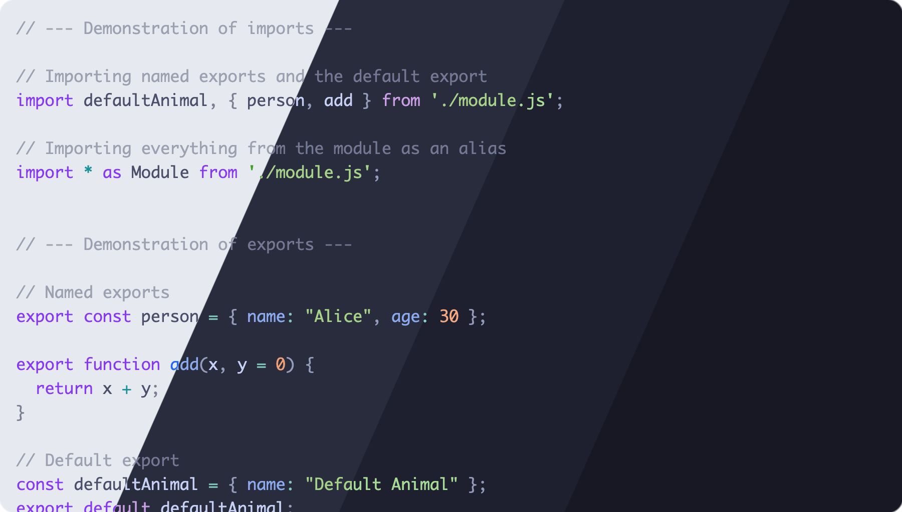
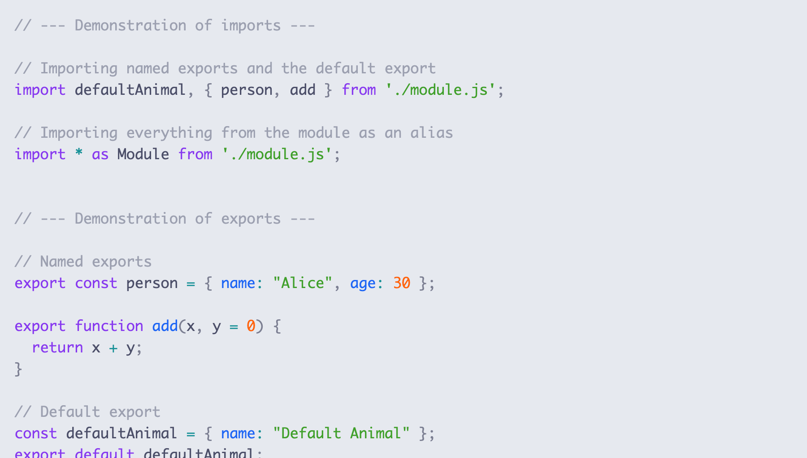
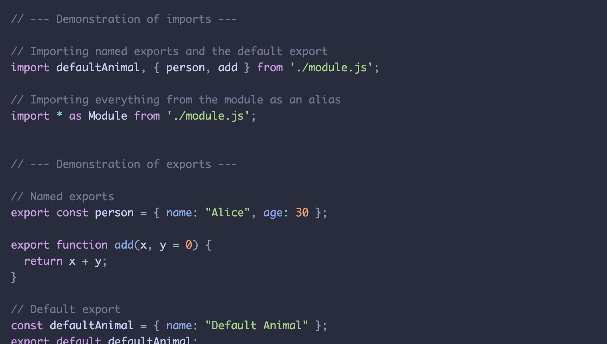
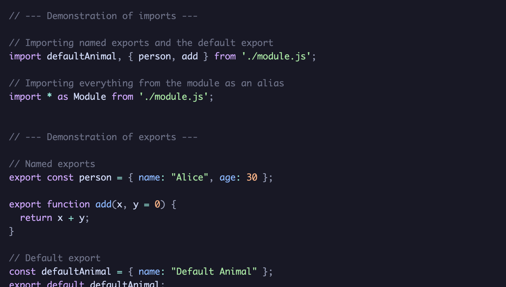

<h3 align="center">
	<br/>
	
	Catppuccin for <a href="https://prismjs.com">Prism.js</a>
	
</h3>

<p align="center">
	<a href="https://github.com/catppuccin/prismjs/stargazers"></a>
	<a href="https://github.com/catppuccin/prismjs/issues"></a>
	<a href="https://github.com/catppuccin/prismjs/contributors"></a>
</p>

<p align="center">
	
</p>

## Previews

<details>
<summary>🌻 Latte</summary>

</details>
<details>
<summary>🪴 Frappé</summary>

</details>
<details>
<summary>🌺 Macchiato</summary>

</details>
<details>
<summary>🌿 Mocha</summary>

</details>

## Usage

> [!NOTE]
> The theme does not contain styling for the layout/padding of the highlighted code.

### Remote stylesheet

Include the theme/stylesheet (`https://prismjs.catppuccin.com/<flavor>.css`) in your page. For example:

```html
<!DOCTYPE html>
<html>
  <head>
    ...
    <link href="https://prismjs.catppuccin.com/mocha.css" rel="stylesheet" />
  </head>
  <body>
    ...
    <script src="prism.js"></script>
  </body>
</html>
```

### Local CSS
```bash
# due to prismjs & this repository having the same name, an alias is used 
yarn add catppuccin-prismjs@https://github.com/catppuccin/prismjs.git
```

#### SCSS
```scss
@import "catppuccin-prismjs/themes/macchiato";

// Apply the theme only to selector
main {
    @import "catppuccin-prismjs/themes/latte";
}
```
> Depending on your scss config, you might have to use "node_modules/catppuccin-prismjs/themes/macchiato";


## 💝 Thanks to

- [uncenter](https://github.com/uncenter)

&nbsp;

<p align="center">
	
</p>

<p align="center">
	Copyright &copy; 2021-present <a href="https://github.com/catppuccin" target="_blank">Catppuccin Org</a>
</p>

<p align="center">
	<a href="https://github.com/catppuccin/catppuccin/blob/main/LICENSE"></a>
</p>
